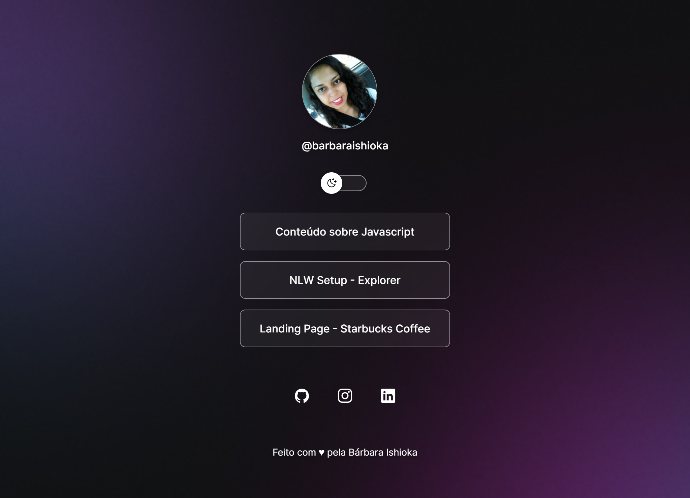

<h1 align="center" id="top"> Projeto Dev Links </h1>

Página com os links dos meus projetos e redes sociais. 

  <a href="#-tecnologias">Tecnologias</a>&nbsp;&nbsp;&nbsp;|&nbsp;&nbsp;&nbsp;
  <a href="#-projeto">Projeto</a>&nbsp;&nbsp;&nbsp;|&nbsp;&nbsp;&nbsp;
  <a href="#-layout">Layout</a>&nbsp;&nbsp;&nbsp;|&nbsp;&nbsp;&nbsp;
  <a href="#memo-licença">Licença</a>

  

 

  

 

## 🚀 Tecnologias

Esse projeto foi desenvolvido com as seguintes tecnologias:

- HTML e CSS
- JavaScript
- Git e Github
- Figma

## 💻 Projeto

Página com os links dos meus projetos e redes sociais, inspirado nas aulas ministradas pelo Mayk Brito da Rocketseat.

É possível escolher os temas dark ou light com o botão switch.

- [Visite o projeto online]()

## 🔖 Layout

Você pode visualizar o layout do projeto através [desse link](https://www.figma.com/community/file/1187422022288947321). É necessário ter conta no [Figma](https://figma.com) para acessá-lo.

## :memo: Licença

Esse projeto está sob a licença MIT.

#

Feito com ♥ by [Bárbara Ishioka](https://www.linkedin.com/in/barbaraishioka/).

<a href="#top">⬆️ Voltar ao topo</a>

